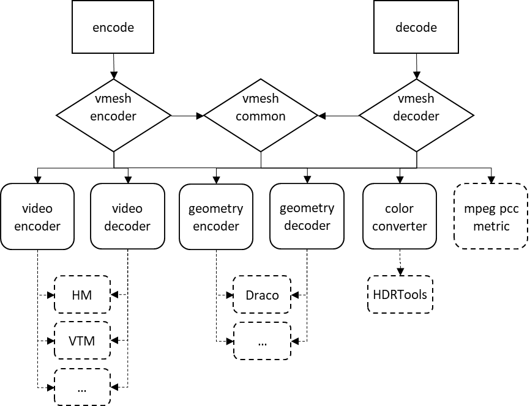

<!--- Architecture  --->
# Architecture 

V-Mesh test model software is organized as shows on Figure 1. 



## Core libraries

The core codec processes are grouped in three lirbaries: 

- `vmeshCommon` containing the util objects and the processes shared by V-Mesh encoding and decoding processes. 
- `vmeshEncoder` containing the V-Mesh encoding processes. 
- `vmeshDecoder` containing the V-Mesh decoding processes. 

## Wrapper libraries

To unify interfaces with external libraries used to encode/decode meshes, encode/decode/convert videos and compute metrics, wrapper libraries
have been created:

- `videoEncoder`: wrapper to HM encoder, VTM encoder;
- `videoDecoder`: wrapper to HM decoder, VTM decoder;
- `geometryEncoder`: wrapper to Draco encoder; 
- `geometryDecoder`: wrapper to Draco decoder;
- `colourConverter`: wrapper to HDRTools.

These libraries are based on a virtual object that can be derived to implement one specific interface with the external libraries. The source codes of the wrapper libraries are stored in the `source/wrapper/` sub-folder.

## Applications 

The source codes of V-Mesh applications are stored in the `source/app/` sub-folder. 

### main applications

The two main application of the V-Mesh test model are: 

- `encode`: that can be used to encode mesh sequence fo a V-MEsh bitstream. 
- `decode`: that decode V-Mesh bitstream.

The following section shows examples of the usage of these softwares.

### Wrapper applications

To evaluate the wrapper libraries specific applications have been created. These applications can be used to crosscheck the usage of the external applications. The source code of these applications are in `source/app/wrapper/` sub-folder: 

- `encodeDraco`;
- `decodeDraco`;
- `encodeVideo`;
- `decodeVideo`;
- `colourConverte`;
- `metrics`.


### Unit test applications

To evaluate the source code and to garantee a early regression detection, unit test application has been created. 

The unit test application is based on [Google Testing Framework](https://github.com/google/googletest). The source code of this software is stored in `source/app/unitTests/`. 
The list of the unit tests that are implemented can be logged with the following command line:

```console
$ ./build/Release/bin/unitTests --gtest_list_tests
draco.
  encode
  decode
metrics.
  compare
hm.
  disp
  disp2
  texture
colourConvert.
  hdrToolsUp
  hdrToolsDown
vmesh.
  all
```

The unit tests can be executed with:
```console
$ ./build/Release/bin/unitTests -v 0
... 
[       OK ] hm.texture (4770 ms)
[----------] 3 tests from hm (5595 ms total)

[----------] 2 tests from colourConvert
[ RUN      ] colourConvert.hdrToolsUp
[       OK ] colourConvert.hdrToolsUp (190 ms)
[ RUN      ] colourConvert.hdrToolsDown
[       OK ] colourConvert.hdrToolsDown (197 ms)
[----------] 2 tests from colourConvert (388 ms total)

[----------] 1 test from vmesh
[ RUN      ] vmesh.all
[       OK ] vmesh.all (49463 ms)
[----------] 1 test from vmesh (49463 ms total)

[----------] Global test environment tear-down
[==========] 9 tests from 5 test suites ran. (64516 ms total)
[  PASSED  ] 9 tests.
```

Note: it's greatly recommended to execute the unit test application before each submission in the repository.
